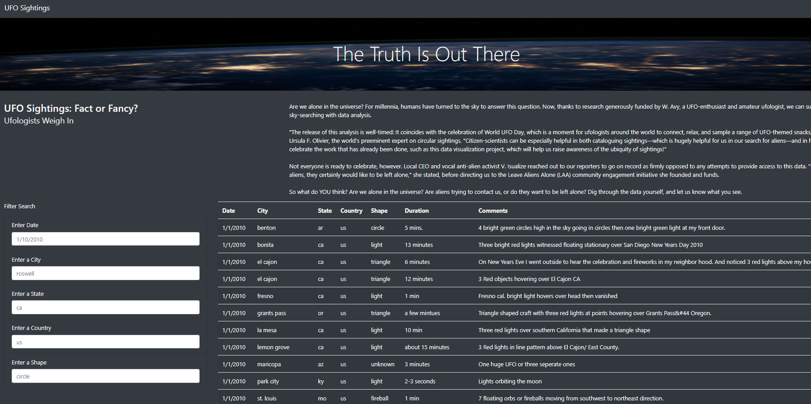

# UFO's

## Overview of Project:

Using Javascript and HTML to develop a webpage containing a dynamic table to review UFO sightings.

### Purpose:

Using Javascript and HTML to develop a webpage containing a dynamic table to review UFO sightings.  The dynamic table features multiple filter criteria (date, city, state, country, and shape) that can be used individually or in combination.   

## Webpage Results and Challenges:

The UFO sightings webpage has been configured to allow multiple filter criteria to be set by users to review UFO sightings that match their search criteria.  To focus a users review of UFO sightings, filter criteria are available for UFO sighting date, city, state, country, and shape.  Each filter criteria can be populated individually or in combination to further refine search results. Example values have been pre-populated into each filter criteria field for users to view the format the filter criteria value should be entered.  After populating at least one filter criteria with a search value and pressing either the Enter or Tab key, the table will update to reflect the UFO sightings that match the filter criteria value.  Below are two illustrations that reflect (1) the full website without any filter criteria entered, (2) the updated table when a filter criteria value is entered (in this case, a state of "nm" is entered for New Mexico).

#### Website Screenshot 

#### Website Screenshot with State Filter Entered

    

When the filter criteria are used in combination with each other, the table will display results for the first criteria value entry and then further refine the results based on the second filter criteria value entry.  Below is an illustration of a two criteria filter setting (in this case, a state of "nm" and a shape of "light").

#### Website Screenshot with State and Shape Filters Entered

Once the filter criteria values entered have been cleared (e.g. deleted), the table updates to reflect either the remaining filter criteria (if a combination was used) or returns to its original state where all UFO sightings are listed in the table.

### Challenges and Difficulties Encountered

No challenges were encountered during the analysis.

## Summary
In a summary statement, describe one drawback of this new design and two recommendations for further development.
A drawback of this new design is that the user must have a good idea of the filter criteria values that they would like to enter or they will return no results.  For example, conspiracy theorists would presume there are UFO sightings in the city of Roswell as the default example city value suggests.  But when "roswell" is entered as a City filter value, no results are returned and the table is empty.  A dropdown menu for the Filter Search criteria would be more user friendly.

In addition to drop down menu selection options for the Filter Search, the following two recommendations would also enhance the webpage:

1.  If no search results are returned from a Filter Search criteria value entry, the table should communicate "No Results Found" so that users do not think there is an issue with the filtering capability of the webpage.

2.  It is difficult to differentiate the default criteria values examples from actual value entries input.  The design should be updated to clearly differentiate default values from user entered values by either changing the font color or making the font bolder or darker for user entered values.  This will allow users to clearly identify filter criteria values they would like to change or remove.

#### Website Screenshot Filter Value Entry Comparison

